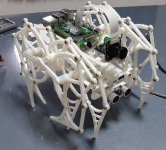
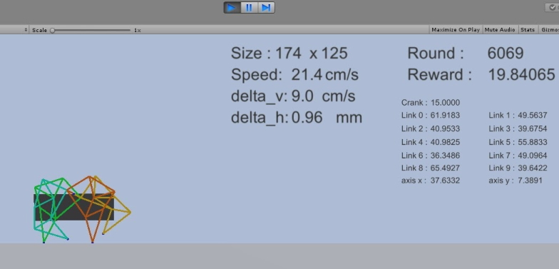
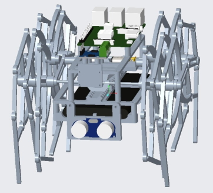
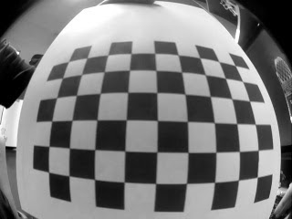
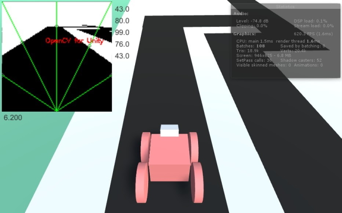
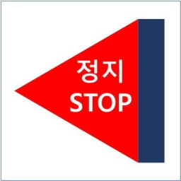
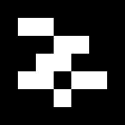
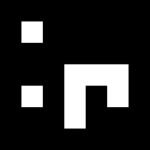
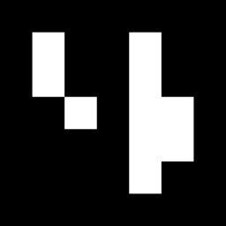
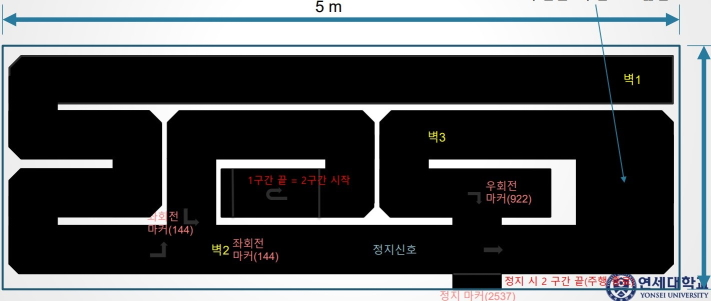

<h1>Vision based autonomous driving robot</h1>



<h2>Project details</h2>

|||
|---|---|
|Period|2020.08 ~ 2020.12|
|Team|None|


|Tech|Detail|
|---|---|
||Main algorism & GPIO control|
||Vision processing|
||Designing leg shape by Reinforcement Learning<br/> Simulating autonomous driving algorism|
||Used in Unity|
||Designing hardware|

<h2>Directory</h2>

```bash
walking_robot       
├─images                        # example images
├─raspberry                     # contain python algorisms
│  ├─armarker                   # generate AR marker
│  ├─auto                       # automatic driving system
│  └─fisheye                    # adjust camera fisheye
└─unity                         # unity projects
    ├─Driving Simulation        
    └─Teo Jansen Simulation  
```   

<h2>Process</h2>

<h3>Parts</h3>

* Raspberry PI 3
    * Cascade 머신러닝 활용한 표지판 인식
    * AR 마커 인식
    * 도로 인식 및 주행 방향 결정 알고리즘
* Camera
    * 광각 카메라 이용 전방 인식
    * fisheye 보정을 통한 이미지 preprocessing
* HC-SR04
    * 초음파 센서 이용 전방 장애물 탐지
<br/><br/>
<h3>Teo-Jansen Mechanism</h3>



unity/Teo Jansen Simulation 폴더에서는 강화학습을 활용한 각 링크 길이 최적화를 수행합니다.
<br/><br/>
<h3>CAD



Creo CAD를 활용한 본체 설계 및 3D Printing은 별도의 작업을 필요로 합니다.
<br/><br/>
<h3>Image Pre-processing</h3>



raspberry/fisheye 폴더에서는 이미지 인식률 개선을 위해 fisheye 어안렌즈 왜곡을 측정합니다.    
raspberry/auto/camera_sensor.py 에서는 다음을 수행합니다.
* fisheye 보정
* OpenCV의 blob labeling 활용해 잔영 제거
* 대비(Contrast)조절을 통하여 선명한 이미지 획득
<br/><br/>
<h3>Driving Simulation</h3>



unty/Driving Simulation 폴더에서는 OpenCV for Unity 외부 에셋을 활용해 실제와 동일한 환경을 구축하고 c#으로 구현된 동일한 주행 알고리즘 테스트를 진행합니다.   
해당 주행 알고리즘은 raspberry/auto/decision_algorithm.py 에 python으로 구현되어 있습니다.
<br/><br/>
<h3>Cascade Image Classification</h3>
    


raspberry pi에서는 무거운 image classification 모델을 구동하기 어렵기도 하고, 학습 데이터가 적을 경우 정확도가 많이 떨어집니다.   
본 프로젝트에서는 고전적인 cascade 방식으로 표지판을 별도의 서드파티 프로그램으로 학습시켰습니다.   
학습 데이터는 raspberry/auto/cascade.xml에 저장되어 있습니다.
<br/><br/>
<h3>AR marker</h3>





도로에 표기된 일부 표지판이 AR marker로 구성되어 있기에, armarker 패키지를 활용해 주행경로 판단 알고리즘을 구성하였습니다.
armaker 생성 알고리즘은 raspberry/armarker 폴더에 구현되어 있습니다.
<br/><br/>
<h3>Course</h3>




본 프로젝트가 자율 주행을 수행한 경로는 위와 같습니다.


